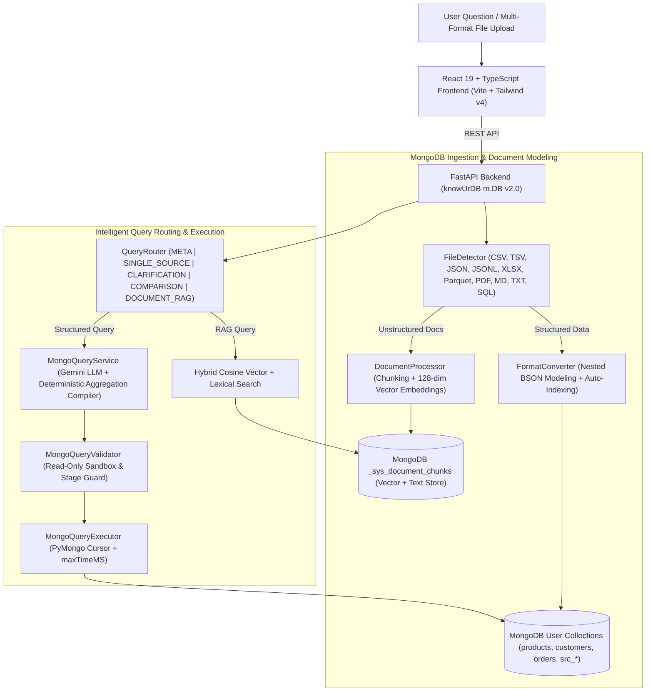

# knowUrDB (m.DB) — MongoDB-First Natural Language Database & Multi-Source Intelligence Platform

**knowUrDB (m.DB)** is an enterprise-grade, **MongoDB-First** Natural Language Database, Multi-Source Analytics, and Vector RAG Intelligence Platform. Built with **FastAPI**, **PyMongo (MongoDB 8.x)**, **React 19**, **TypeScript**, and **Google Gemini AI**, it translates plain-English analytical questions into validated, read-only **MongoDB Aggregation Pipelines** (`$match`, `$group`, `$sort`, `$lookup`, `$unwind`, `$project`, `$count`), executes them against native MongoDB document collections, and synthesizes interactive charts, tabular datasets, and cited RAG responses.

---

## Key Capabilities

1. **MongoDB-Native Storage & Document Modeling**
   - Every dataset, workspace, metadata registry, query history entry, and vector chunk lives inside **MongoDB** (`knowurdb`).
   - Automatic nested BSON document modeling: tabular records with hierarchical keys (`contact_email`, `address_city`, `items[]`) are transformed into rich embedded sub-documents (`contact.email`, `address.city`, `items[]`) while preserving top-level queryability.
   - Intelligent index provisioning (`_create_intelligent_indexes`) automatically indexes identifier, status, category, email, and date fields upon ingestion.

2. **Natural Language to MongoDB Aggregation Engine**
   - **LLM + Deterministic Compiler (`MongoQueryService`)**: Converts user questions into structured JSON specifications (`{"operation": "aggregate", "collection": "...", "pipeline": [...]}`) and readable `db.<collection>.aggregate([...])` pipelines.
   - Supports nested field paths (`$match` on `"address.city"`, `$unwind` on `"$items"`), cross-collection joins (`$lookup`), multi-metric groupings (`$group`), and sorting/limiting (`$sort`, `$limit`).

3. **Strict Read-Only Security Sandbox (`MongoQueryValidator`)**
   - Multi-layer security gateway allowing **only** `find`, `aggregate`, `count`, and `distinct`.
   - Explicitly blocks all write/DDL commands (`insert*`, `update*`, `delete*`, `drop*`, `bulkWrite`, `renameCollection`), server-side JavaScript (`$where`, `$function`, `$accumulator`, `eval`, `mapReduce`), pipeline write stages (`$out`, `$merge`), and internal system collections (`_sys_*`, `system.*`).

4. **Multi-Source Routing, Ambiguity Detection & Cross-Source Comparison**
   - **QueryRouter**: Automatically routes questions to `META`, `SINGLE_SOURCE`, `CLARIFICATION_REQUIRED`, `COMPARISON`, or `DOCUMENT_RAG`.
   - **Interactive Clarification**: When multiple uploaded MongoDB sources match a user's question with similar confidence, presents an interactive source disambiguation card.
   - **Cross-Source Comparison**: Runs parallel aggregation pipelines across multiple MongoDB collections (e.g. Q1 vs Q2 sales) and synthesizes side-by-side deltas.

5. **MongoDB Vector RAG for Unstructured Documents**
   - Uploads of `.pdf`, `.md`, and `.txt` files are extracted, merged by semantic sections, chunked with overlap, embedded into **128-dimensional L2-normalized dense vectors**, and stored in `_sys_document_chunks`.
   - Hybrid **Cosine Vector Similarity + Lexical Relevance** retrieval returns cited document passages (`chunk_id`, `page_number`, `score`).

---

## System Architecture



---

## Why MongoDB-First?

| Dimension | Legacy SQL/SQLite Architecture | knowUrDB (m.DB) MongoDB-First Architecture |
| :--- | :--- | :--- |
| **Data Model** | Flat 2D tables requiring rigid DDL schemas | Native BSON documents with embedded objects (`contact`, `address`) & arrays (`items[]`) |
| **Concurrency** | Single-file SQLite lock bottlenecks on concurrent writes | Pooled PyMongo connections (`maxPoolSize=50`) with collection-level isolation |
| **Query Language** | Fragile SQL text generation & dialect mismatches | Expressive JSON Aggregation Pipelines (`$match`, `$unwind`, `$group`, `$lookup`, `$sort`) |
| **Metadata & RAG** | Scattered across `app.db`, `.sqlite` files, and filesystem | Unified inside MongoDB (`_sys_sources`, `_sys_collections_metadata`, `_sys_document_chunks`, `_sys_query_history`) |
| **Security Validation** | Regex/AST SQL string parsing | Structural JSON inspection of operations, pipeline stages, and BSON operators |

---

## Tech Stack

- **Database**: MongoDB 8.x (`pymongo 4.18+`, `mongomock 4.3+` fallback for isolated environments)
- **Backend**: Python 3.12, FastAPI, Pydantic v2, Pandas, PyArrow, OpenPyXL, PyPDF2, Google GenAI SDK (`google-genai`)
- **Frontend**: React 19, TypeScript 5.9, Vite 8, Tailwind CSS v4, Recharts, Lucide Icons, Framer Motion
- **Testing & Quality**: Pytest (`51/51` backend tests), Vitest (`6/6` frontend tests), Ruff (`All checks passed`), Oxlint (`0 errors`)

---

## Project Structure

```text
knowUrDB.(m.DB)/
├── backend/
│   ├── app/
│   │   ├── api/                 # FastAPI routers (health, query, schema, sources, history, suggestions, ai, settings)
│   │   ├── core/                # MongoDBManager (mongodb.py), config.py, exception handlers
│   │   ├── models/              # Pydantic v2 models (QueryResponse, SourceMetadata, SchemaResponse)
│   │   └── services/            # Core MongoDB services:
│   │       ├── demo_generator.py          # Rich MongoDB demo dataset (products, customers, orders, employees, students)
│   │       ├── document_processor.py      # PDF/MD/TXT chunking + 128-dim L2 vector embeddings + cosine search
│   │       ├── mongo_validator.py         # Read-only MongoDB security validator
│   │       ├── query_executor.py          # PyMongo aggregation & find executor with maxTimeMS
│   │       ├── schema_service.py          # BSON type, nested path, index & $lookup relationship introspector
│   │       ├── text_to_sql_service.py     # MongoQueryService (NL -> MongoDB Aggregation Pipeline)
│   │       └── ingestion/                 # FileDetector, FormatConverter, IngestionPipeline, SQL migration importer
│   ├── tests/                   # Comprehensive 51-test Pytest suite (unit, API, E2E, security)
│   ├── pyproject.toml           # Python & Ruff configuration
│   └── requirements.txt         # Backend dependencies
├── frontend/
│   ├── src/
│   │   ├── components/workspace/ # MongoQueryPanel (SqlPanel.tsx), QueryResult, ResultsTable, ChartView
│   │   ├── pages/                # Workspace, Schema (Collection & BSON Explorer), SourceLibrary, MultiUpload, History
│   │   ├── services/             # Typed Axios API client
│   │   └── types/                # MongoDB-aware TypeScript interfaces
│   └── package.json
├── docs/                        # Deep-dive engineering documentation
└── docker-compose.yml           # Full-stack Docker orchestration (MongoDB 7 + Backend + Frontend)
```

---

## Quick Start & Setup

### 1. Prerequisites
- **MongoDB Community Server 7.0+ / 8.0+** running on `mongodb://localhost:27017` (or Docker Desktop)
- **Python 3.11+**
- **Node.js 20+**

### 2. Backend Setup
```bash
cd backend
python -m venv venv
# Windows PowerShell:
.\venv\Scripts\Activate.ps1
pip install -r requirements.txt

# Copy .env.example to .env and configure optional GEMINI_API_KEY
cp .env.example .env

# Launch FastAPI server (auto-initializes MongoDB collections, indexes & demo dataset)
uvicorn app.main:app --reload --port 8000
```

### 3. Frontend Setup
```bash
cd frontend
npm install
npm run dev
```
Open `http://localhost:5173` in your browser.

### 4. Docker Compose (Full Stack + MongoDB)
```bash
docker compose up --build -d
```

---

## Supported File Types & Ingestion Matrix

| Format | Extensions | Target Storage | MongoDB Modeling Behavior |
| :--- | :--- | :--- | :--- |
| **CSV / TSV** | `.csv`, `.tsv` | User Collection (`src_<id>_<name>`) | Normalizes types, models semantic prefixes (`contact_*`, `address_*`) into nested BSON subdocuments, creates indexes |
| **JSON / JSONL** | `.json`, `.jsonl`, `.ndjson` | User Collection(s) | Preserves native nested objects and arrays directly in MongoDB |
| **Excel** | `.xlsx`, `.xls` | 1 Collection per Worksheet | Converts each sheet into an indexed MongoDB collection |
| **Parquet** | `.parquet` | User Collection | High-speed columnar ingestion via PyArrow into BSON documents |
| **PDF / Markdown / Text** | `.pdf`, `.md`, `.txt` | `_sys_document_chunks` | Extracts pages/sections, chunks text, computes 128-dim vector embeddings for RAG |
| **Legacy SQL / SQLite** | `.sql`, `.db`, `.sqlite` | User Collection(s) | Isolated migration importer converts legacy tables into native MongoDB collections |

---

## Testing & Verification

```bash
# Backend Test Suite (51 tests covering MongoDB CRUD, Aggregation, Ingestion, RAG & Security)
cd backend
python -m pytest -v

# Backend Linter
python -m ruff check .

# Frontend Unit Tests & Production Build
cd ../frontend
npm run test
npm run lint
npm run build
```

---

## Detailed Documentation

- [Architecture & Data Flow](docs/architecture.md)
- [MongoDB Collection Design & Indexing](docs/mongodb.md)
- [Natural Language to MongoDB Query Engine](docs/query-engine.md)
- [Document RAG & Vector Search Pipeline](docs/rag.md)
- [Multi-Format Ingestion Pipeline](docs/ingestion.md)
- [Security Model & Query Sandbox](docs/security.md)
- [Testing & QA Guide](docs/testing.md)
